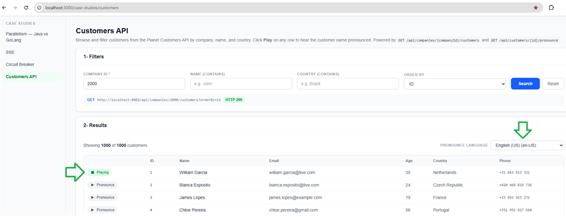

# Portfolio Frontend

Personal portfolio site for **Mario Sérgio**

## Portfolio

### Mario Silva · Software Architect

**Contact & Links**

- 💼 LinkedIn: [linkedin.com/in/mariosergio30](https://www.linkedin.com/in/mariosergio30)
- 🦊 GitHub - exploratory projects: [github.com/mariosergio-portfolio/](https://github.com/orgs/mariosergio-portfolio/repositories)
- ✉️ Email: [mariosergio30@gmail.com](mailto:mariosergio30@gmail.com)
- 📍 Home: Braga, Braga (Portugal)

## Pages

- **Home** — landing page with a short intro and contact links.
- **Projects** — a selection of built projects with tags and links.
- **Contact** — contact channels (email, LinkedIn, GitLab, location).
- **Case Studies** — a set of focused, interactive technical demos:
  - **Parallelism — Java vs Go** — compares parallel counter execution between a Java thread-pool server and a Go goroutine server, against local and AWS-hosted environments.
  - **Customers API** — a live UI for the [customers-api](https://github.com/mariosergio-portfolio/customers-api) backend: search/filter customers by company, name and country, and play back as Polly-synthesized pronunciations of each customer name.
  **Here we explore the AWS AI and Machine Learning Services: Polly (text to speach); Amazon Bedrock (natural language processing).**

    
    *Filtering customers and playing back a Polly-synthesized pronunciation, powered by [customers-api](https://github.com/mariosergio-portfolio/customers-api).*
- **SSE** — practical exploration of Server-Sent Events as a unidirectional streaming mechanism, compared with WebSockets.
- **Circuit Breaker** — deep dive into the Circuit Breaker resilience pattern (closed/open/half-open) and its implementation with Resilience4j / Go equivalents.
  
## Tech stack

- React 19, React Router 7
- TypeScript, Vite 6
- Tailwind CSS 4
- ECharts (data visualizations in case studies)
- ESLint + Prettier (with `prettier-plugin-tailwindcss`)

## Configuration

Environment variables are read from `.env` (see [.env](.env)) and consumed via `import.meta.env`:

| Variable | Description |
|---|---|
| `VITE_CUSTOMERS_BASE` | Base URL of the [customers-api](https://github.com/mariosergio-portfolio/customers-api) service, used by the Customers API case study page. Defaults to `http://localhost:8082`. |
| `VITE_PARALLELISM_ENV_{N}_LABEL` | Display label for parallelism environment `N`. |
| `VITE_PARALLELISM_ENV_{N}_JAVA_BASE` | Base URL of the Java server for environment `N`. |
| `VITE_PARALLELISM_ENV_{N}_GO_BASE` | Base URL of the Go server for environment `N`. |

## Running locally

Prerequisites: Node.js and npm.

```bash
npm install
npm run dev
```

The app will be available at the Vite dev server URL (typically `http://localhost:5173`). For the Customers API case study to work, also run [customers-api](https://github.com/mariosergio-portfolio/customers-api) locally on port `8082` (or point `VITE_CUSTOMERS_BASE` at a running instance).

Other scripts:

```bash
npm run build     # type-check and build for production
npm run preview   # preview the production build
npm run lint      # run ESLint
npm run format    # format with Prettier
```

## Project structure

```
src/
├── pages/
│   ├── case-studies/   # Parallelism, SSE, Circuit Breaker, Customers API
│   ├── HomePage.tsx
│   ├── ProjectsPage.tsx
│   └── ContactPage.tsx
└── router/              # App routing and navigation layout
```
